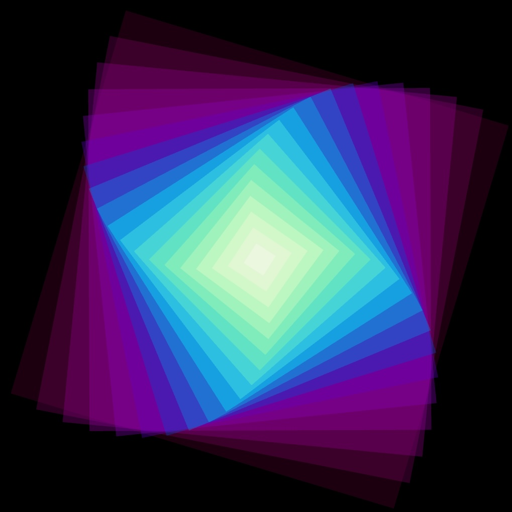

# Satisfying Squares, a 3D Art Project, with @React-Three/Fiber
A basic template for R3F projects

```
yarn
yarn dev
```




A simple JavaScript project using [@React-Three/Fiber](https://r3f.docs.pmnd.rs/getting-started/introduction), Creates an animation features multiple rotating meshes with dynamic colors and scaling.

## Features

- Animated rotation and color-changing meshes
- Responsive canvas that adjusts to window resizing

Tutorial on [YouTube]()